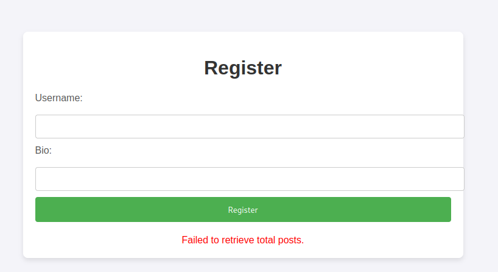
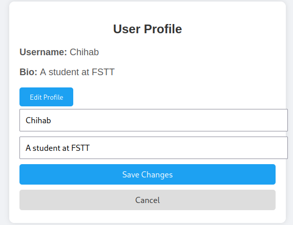
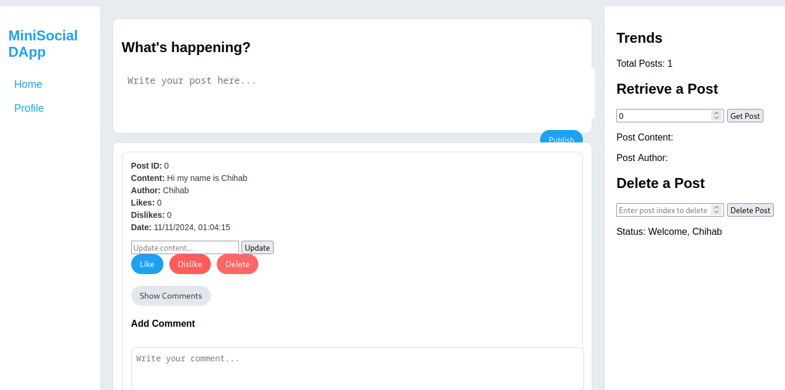

## Rapport de Projet

### Titre du Projet : MiniSocial – Réseau Social décentralisé sur Blockchain

### Auteur : LIEFRID Chihab Eddine

---

### Contexte et Motivation

Le développement des réseaux sociaux a révolutionné la manière dont les gens interagissent et partagent des informations. Cependant, les réseaux sociaux centralisés posent des défis en matière de confidentialité et de transparence. Pour pallier ces limites, nous proposons **MiniSocial**, une plateforme sociale décentralisée construite sur une blockchain, où chaque utilisateur est responsable de son contenu. Ce projet vise à offrir une plateforme sécurisée, transparente et respectueuse de la vie privée grâce à l’utilisation de smart contracts sur Ethereum.

### Objectifs du Projet

Les objectifs de MiniSocial sont les suivants :

1. Créer un contrat intelligent pour gérer les profils utilisateurs, les publications, et les commentaires de manière sécurisée et décentralisée.
2. Assurer un enregistrement unique des utilisateurs grâce à leur adresse Ethereum.
3. Permettre aux utilisateurs d’ajouter, mettre à jour, commenter et aimer des publications.
4. Proposer une interface simple et intuitive pour interagir avec le smart contract.

---

### Description de la Solution

MiniSocial repose sur des smart contracts en Solidity et une interface utilisateur en JavaScript. L’architecture décentralisée élimine le besoin de serveurs centraux, offrant une solution transparente et immuable.

#### 1. Structure des Données et Fonctionnalités

**Structures principales** :
- **Utilisateur** : Représenté par un profil incluant un nom d’utilisateur et une biographie, stocké par l’adresse Ethereum.
- **Post** : Contient l’auteur (adresse), un identifiant unique, du contenu, et un timestamp pour la date de création.
- **Commentaire** : Relie chaque commentaire à un post spécifique, incluant l’auteur et le contenu.

**Fonctionnalités clés** :
- **Enregistrement d’un Utilisateur** : Permet à un utilisateur de créer un profil unique.
- **Ajout, Mise à jour, Suppression de Posts** : Les utilisateurs peuvent ajouter et mettre à jour leurs publications, mais seulement s’ils sont auteurs du contenu.
- **Ajout de Commentaires** : Les utilisateurs peuvent commenter les posts existants.
- **Système de Réactions (Like/Dislike)** : Les utilisateurs peuvent indiquer s’ils aiment ou non une publication.

#### 2. Interaction avec le Contrat

Chaque interaction avec le contrat est gérée via des appels de fonction Solidity et déclenche des événements pour enregistrer les actions des utilisateurs. L’interface utilisateur en JavaScript, utilisant Web3.js, permet de :
- **Afficher les Posts** : Récupération de tous les posts via un mapping des identifiants de posts.
- **Mettre à jour le contenu d’un post** : Un champ d’édition est affiché à côté de chaque post avec un bouton d’envoi pour sauvegarder les modifications via le smart contract.

---

### Développement et Déploiement

#### Technologies Utilisées
- **Solidity** : Pour le développement du smart contract.
- **JavaScript (Web3.js)** : Pour l’interface front-end et l’interaction avec le smart contract.
- **Ethereum Testnet** : Pour déployer et tester le contrat de manière sécurisée.
  
#### Fonctions principales du Smart Contract

1. **registerUser** : Permet aux utilisateurs de créer leur profil.
2. **addPost** : Crée un post unique, attaché à l’adresse de l’utilisateur.
3. **updatePost** : Modifie le contenu d’un post existant (accessible uniquement à l’auteur).
4. **addComment** : Ajoute un commentaire lié à un post particulier.
5. **getUserProfile** : Récupère les informations d’un utilisateur pour afficher son profil sur le front-end.
6. **getTotalPosts** : Retourne le nombre total de publications pour faciliter la pagination ou les analyses.
7. **likePost / dislikePost** : Permet de réagir aux posts.

---
### Interface Graphique
#### Page d'enregistrement
Dans le cas que l'utilisateur n'est pas déja un utilisateur de l'application il sera dirigier à cette page ou il va choisir un username et écrire une Bio .
Cette fonctionalité à était implementé par *mapping* de tout les utilisateurs avec un *addresse* , cette adress fonctionne comme identifiant unique de chaque user.

#### Page de profile
Ici l'utilisateur peut consulter son profile et rapporté des modification .

#### Page de Flux
Ici L'utilisateur peut consulter les publications des autres utilisateurs de l'application commenter et réagir avec un like ou dislike et aussi de modifier les posts qui appartient à lui méme.

---

### Résultats et Evaluation

L'implémentation de MiniSocial démontre les avantages de l’utilisation de la blockchain pour la gestion de contenus sociaux. L’absence d’une base de données centralisée permet une transparence totale et une réduction des risques liés à la centralisation. Voici un résumé des résultats :

- **Transparence et Sécurité** : Chaque modification de post ou ajout de commentaire est enregistré de manière immuable sur la blockchain.
- **Contrôle Utilisateur** : Les utilisateurs sont les seuls propriétaires et gestionnaires de leurs données.
- **Décentralisation** : L’infrastructure décentralisée réduit les besoins en serveurs et en maintenance.

### Problèmes rencontrés et Limites

1. **Limitations de Gas** : Les transactions pour ajouter des commentaires et modifier des posts peuvent devenir coûteuses si le nombre d’interactions est élevé.
2. **Stockage** : Les blockchains ne sont pas optimisées pour stocker de grandes quantités de données, limitant ainsi la taille des contenus (publications, commentaires).
3. **Latence des Transactions** : Les interactions peuvent être lentes à cause du temps de confirmation des transactions sur la blockchain.

---

### Conclusion et Perspectives

MiniSocial montre qu’il est possible de construire un réseau social décentralisé, sécurisé et transparent. Cependant, pour améliorer l’expérience utilisateur, des améliorations sont possibles, comme :
- **Utiliser un stockage hors chaîne (ex. IPFS)** pour les contenus lourds et ne conserver que les métadonnées sur la blockchain.
- **Optimisation des coûts** : En explorant d'autres blockchains avec des frais de transaction moindres (Polygon, Binance Smart Chain).
- **Fonctionnalités supplémentaires** : Ajouter des fonctionnalités comme la messagerie privée ou des groupes pour augmenter l’engagement utilisateur.

Ce projet offre une solution de réseau social axée sur la décentralisation et la confidentialité, ouvrant des perspectives pour l’implémentation de systèmes de communication sécurisés sur blockchain.

---

### Références

1. [Solidity Documentation](https://docs.soliditylang.org/)
2. [Web3.js Documentation](https://web3js.readthedocs.io/)
3. [Ethereum Test Networks](https://ethereum.org/en/developers/docs/networks/)
